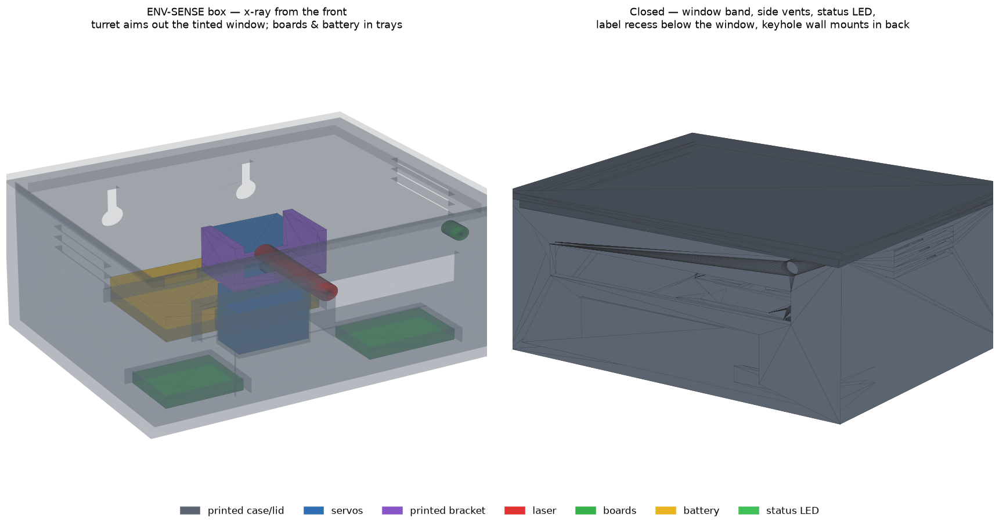
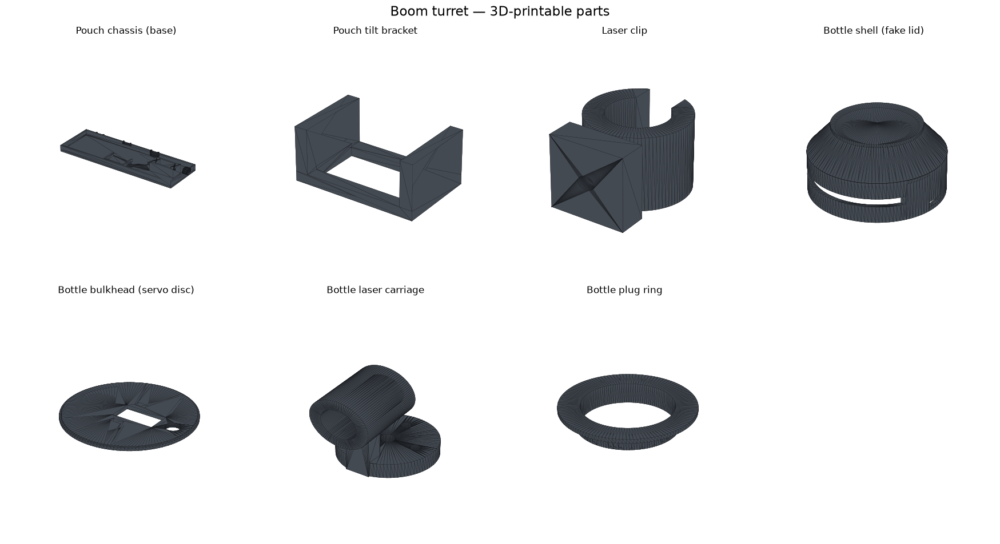
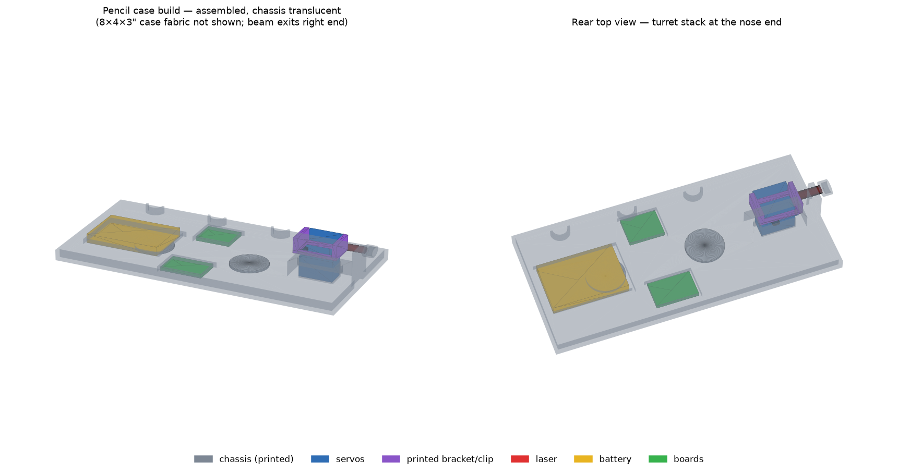
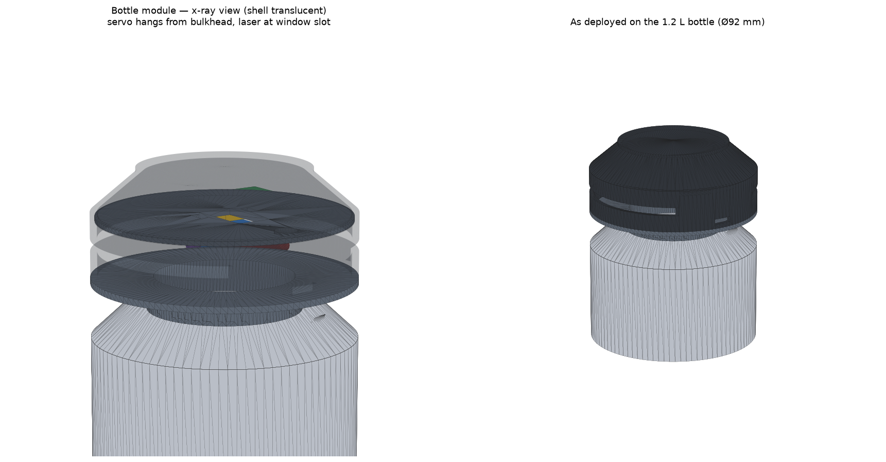

# Boom — Covert Desk Laser Turret

A tiny pan-tilt laser turret disguised as everyday desk objects, controlled
from your phone. Two enclosure designs are included:

| Design | Disguise | Coverage | Difficulty | Docs |
|---|---|---|---|---|
| **ENV-SENSE Box** ⭐ | "Facilities air-quality sensor" on a shelf across the room | ~90° pan + tilt | ★ Easiest print, strongest disguise | [designs/sense-box.md](designs/sense-box.md) |
| **Pencil Pouch** | Black fabric pencil pouch (yours) | ~70° aimable arc | ★ Easy | [designs/pencil-pouch.md](designs/pencil-pouch.md) |
| **Bottle Top Module** | ThermoFlask water bottle (yours) | 300° panoramic | ★★ Needs a well-fitted print | [designs/bottle-top.md](designs/bottle-top.md) |

⭐ **Recommended**: the pouch and bottle imitate your own belongings — the
objects your coworkers know best, at your seat, with the beam pointing
back at you. The ENV-SENSE box imitates anonymous office infrastructure
placed away from you; nobody inspects it and nothing links it to you.
See [designs/sense-box.md](designs/sense-box.md).

## Getting the 3D models — no software needed

**Ready-to-print STL files are in [`hardware/stl/`](hardware/stl/).**
Click any `.stl` file on GitHub and it opens in an interactive 3D viewer
right in your browser — drag to rotate, scroll to zoom. To print, download
the file (Download raw file button) and hand it to any 3D printer or
online print service as-is.

**Assembled views** (`ASSEMBLED_pouch.stl` / `ASSEMBLED_bottle.stl` show
the whole machine put together — view them in GitHub's 3D viewer; they are
for visualization, print the individual parts):

The STLs are built with these measurements:

- Pencil case build: **4 × 8 × 3 inch** boxy case (203 × 102 mm interior,
  beam axis 42 mm above the floor)
- Bottle module (low-profile v2): **1.2 L (40 oz) ThermoFlask** — body
  Ø **92 mm**, mouth opening Ø **54 mm**. The mechanism sinks into the
  bottle neck, so the visible cap is only **~26 mm tall**. Mouth diameter
  is an estimate — verify the `bottle_bucket` fit before printing the
  shell.

Note: the pouch build still has an OpenSCAD source (`pouch_chassis.scad`);
the bottle module's source of truth is `generate_stls.py` only.

If your measurements differ, the models are parametric — regenerate with
`python3 hardware/generate_stls.py` (edit the numbers at the top; needs
`pip install trimesh manifold3d scipy numpy`), or use the equivalent
OpenSCAD sources (`hardware/*.scad`) if you prefer a GUI.

## Shared electronics (both designs)

| Part | Approx. cost | Notes |
|---|---|---|
| ESP32-C3 SuperMini | ~$4 | Tiny (18×22 mm) WiFi microcontroller |
| SG90 / MG90S micro servo ×1–2 | ~$3 ea | MG90S metal-gear is quieter — worth it |
| 5 mW red laser diode module (6 mm) | ~$2 | KY-008 style |
| 3.7 V LiPo battery (500–1000 mAh) | ~$6 | Pouch fits a big one; bottle needs slim 401230/502030 |
| TP4056 USB-C charge board | ~$1 | Charge port + battery protection |
| Slide switch, jumper wires | ~$2 | |

Total: **under $20**. No soldering strictly required to prototype (breadboard
first), but the final compact builds want ~6 solder joints.

## How it works

Firmware lives in [`firmware/boom_turret/`](firmware/boom_turret/) —
flash it with the Arduino IDE (setup steps in the file header). The ESP32
creates its own WiFi access point (`BOOM-net`); join it on your phone and
open `http://192.168.4.1` for the touch joystick. Features:

- Smooth sine-eased motion (no robotic jerks, less servo noise)
- Auto-patrol mode: slow random drifts with long pauses
- **Freeze button**: instantly parks and blacks out when eyes start hunting
- **Tilt ceiling enforced in firmware**: the beam physically cannot rise
  above a configured angle, so it can never reach faces/eyes

## Safety (real talk)

Even a 5 mW class-3R diode should never hit an eye. Both mechanical designs
have a built-in downward tilt bias and the firmware clamps the tilt range.
Configure the ceiling for your room so the beam stays on floors, walls
below chest height, and ceilings only if aimed from a high shelf. Don't
point at reflective surfaces near faces. Entertain responsibly.
